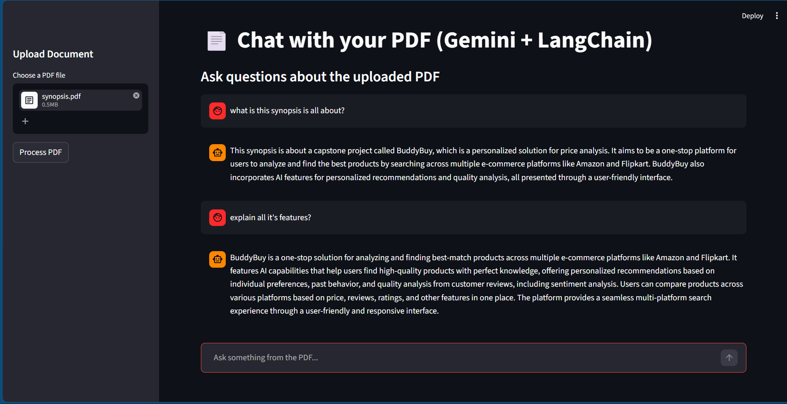

# 📄 PDF Chat with Gemini + LangChain (RAG)

A modern **Retrieval-Augmented Generation (RAG)** application that lets you chat with your PDF documents using Google's Gemini models.

Built with **Streamlit**, **LangChain**, **FAISS**, and **Gemini 2.5 Flash**.



## ✨ Features

- Upload any PDF and chat with its content
- Fast and accurate answers powered by Gemini
- Vector search using FAISS
- Modern LangChain LCEL chains (Retrieval + Stuff)
- Clean and responsive Streamlit interface with chat history
- Environment-based API key management

## 🛠️ Tech Stack

- **Frontend**: Streamlit
- **LLM**: Google Gemini 2.5 Flash (via `langchain-google-genai`)
- **Embeddings**: Gemini Embedding (`gemini-embedding-001`)
- **Vector Store**: FAISS (CPU)
- **Document Loader**: PyPDFLoader
- **Framework**: LangChain + LangChain Classic

## 📋 Requirements

Make sure you have the following installed:

```bash
pip install -r requirements.txt
```

### `requirements.txt`
```txt
streamlit
langchain
langchain-community
langchain-google-genai
langchain-classic
faiss-cpu
pypdf
python-dotenv
```

## 🚀 Setup & Run

1. Clone the repository:
   ```bash
   git clone https://github.com/kunalatmosoft/rag.git
   cd rag
   ```

2. Create a `.env` file in the root directory and add your Google API key:
   ```env
   GOOGLE_API_KEY=your_google_api_key_here
   ```

3. Get your Gemini API key from: [https://aistudio.google.com/app/apikey](https://aistudio.google.com/app/apikey)

4. Run the app:
   ```bash
   streamlit run app.py
   ```

## 📁 Project Structure

```
pdf-gemini-rag/
├── app.py                  # Main Streamlit application
├── rag_pipeline.py         # Vector store + RAG chain logic
├── utils.py                # Helper functions (save uploaded file)
├── .env                    # Environment variables (not committed)
├── requirements.txt
└── README.md
```

## 🔧 Key Configurations

- **LLM Model**: `gemini-2.5-flash` (fast & cost-effective)
- **Embedding Model**: `gemini-embedding-001`
- **Chunk Size**: 1000 characters with 200 overlap
- **Retriever**: Top 6 similar chunks

> You can easily switch to `gemini-2.5-pro` for higher quality answers.

## 📸 Demo


## 🤝 Contributing

Contributions, issues, and feature requests are welcome!

1. Fork the project
2. Create your feature branch (`git checkout -b feature/amazing-feature`)
3. Commit your changes (`git commit -m 'Add some amazing feature'`)
4. Push to the branch (`git push origin feature/amazing-feature`)
5. Open a Pull Request

## 📄 License

This project is open source and available under the [MIT License](LICENSE).

---

**Made with ❤️ using Gemini + LangChain**
